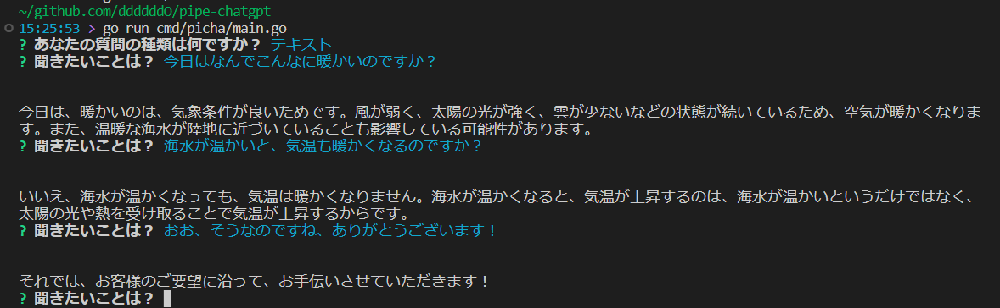

# pipe-chatgpt
インタラクティブにファイルや音声、テキストをchatgptに問い合わせるCLI

## Tahks!
- https://github.com/go-survey/survey
- https://github.com/PullRequestInc/go-gpt3
- https://github.com/mattn/chatgpt

## Features
- [x] 入力されたテキストをChatGPT3へ聞く
- [ ] ChatGPT3にテキストファイルを解析?してもらう
- [ ] ChatGPT3に音声(ファイル?)を解析?してもらう

## Installation

```console
$ go install github.com/ddddddO/pipe-chatgpt/cmd/picha
```

## Usage

- `CHATGPT_API_KEY` 環境変数にChatGPTのAPIKeyを設定するか、未設定時にインタラクションに沿ってAPIKeyを入力するかしてChatGPT3が利用できるようにします。



